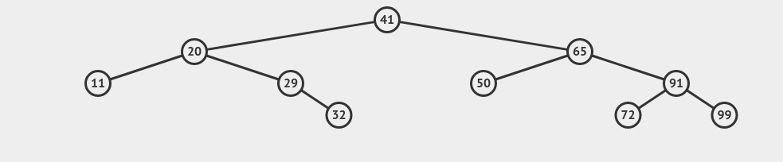

# Binary Search Tree

- Desafios: 
    - Criar uma BST deste formato: 
    - Implementar os métodos: 
        - insert
        - findLeaves
        - showLeavesLevelAndValue
        - showAllNodesLevelAndValue
        - valueExists 

